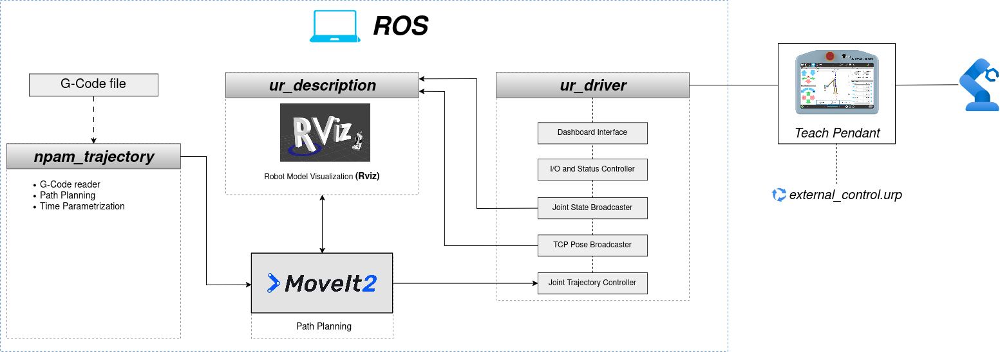

<a name="home"></a>
# REPOSITORIO DE NPAM PROJECT (INGENIA 25/26)

Este repositorio ha sido desarrollado para el control del movimiento de un robot colaborativo, con el objetivo de habilitar procesos de fabricación aditiva no plana (NPAM).

De forma paralela a este Trabajo de Fin de Máster, se ha colaborado en el desarrollo de la asignatura [INGENIA 25/26](https://www.escuelaindustrialesupm.com/asignatura-ingenia/) en la Escuela Técnica Superior de Ingenieros Industriales (ETSII) de la Universidad Politécnica de Madrid.


## Built with the tools and technologies


---

## ÍNDICE

- [Introducción](#introducción)
- [Puesta en Marcha](#getting-started)
  - [Requisitos Previos](#prerequisites)
  - [Instalación](#installation)
  - [Casos de uso](#usage)
- [Contenidos](#content)

---

<a name="introduccion"></a>
## INTRODUCCIÓN

En este repositorio se implementa una arquitectura de control modular basada en ROS2 para el control de un robot colaborativo UR10. La finalidad de este control es su aplicación en procesos de 
fabricación aditiva no planar (**NPAM**, _Non-planar Additive Manufacturing_).  

En los procesos de fabricación convencionales, el material se deposita en capas horizontales, planas y paralelas a la cama de impresión. Sin embargo, la fabricación no planar elimina esta restricción: 
la deposición se lleva a cabo mediante superficies curvas que se adaptan mejor a la geometría del modelo. Esto permite imprimir sobre superficies curvas, reducir marcas de capa, y mejorar las
características estructurales de la pieza. Esto convierte el problema de trayectorias en un problema de planificación cartesiana 6D, donde la posición y orientación del tcp deben controlarse simultáneamente.

Este repositorio se enmarca como Trabajo de Fin de Máster desarrollado en la Universidad Politécnica de Madrid. Además, sirve como repositorio auxiliar para la asignatura INGENIA del curso 2025/26, denominada
"Diseño de Sistemas Inteligentes con Robots y AGVs", en el que los alumnos desarrollan proyectos de impresión 3D en entornos multidisciplinares. 

Este repositorio se ha apoyado en el trabajo y código de cursos anteriores:
- [Curso 2023/24](https://github.com/Miguel-LA/TFM_MiguelLerinAlonso): Miguel Lerín Alonso
- [Curso 2024/25](https://github.com/AdelaJim/TFM_AdelaJimenez?tab=readme-ov-file): Adela Jiménez

---
<a name="getting-started"></a>
## PUESTA EN MARCHA

<a name="prerequisites"></a>
### Requisitos Previos

**Software**

| Requisito | Versión |
|-----------|:-------:|
| Ubuntu | 22.04 LTS |
| ROS 2 | [Humble Hawksbill](https://docs.ros.org/en/humble/Installation.html) |
| MoveIt2 | Compatible con Humble |
| Python | 3.10+ |

**Hardware**

- Robot de Universal Robots UR10 (compatible con CB3 / e-Series)
- Conexión Ethernet directa entre el PC de control y el controlador del robot.

<a name="installation"></a>
### Instalación

**1. Instalar herramientas de desarrollo**

Para comenzar con la instalación, es recomendable actualizar la lista de paquetes e instalar las dependencias necesarias del sistema

```bash
sudo apt update
sudo apt install python3-colcon-common-extensions python3-rosdep git -y
```

**2. Clonar el repositorio**

El siguiente paso es clonar el repositorio en una carpeta llamada `workspace`

```bash
mkdir -p ~/workspace/src
```
```bash
cd ~/workspace/src
```
```bash
git clone https://github.com/PedroAcero/tfm_workspace.git
```

**3. Instalación de las dependencias del sistema**

Antes de compilar, es necesario instalar los paquetes de ROS2 necesarios para que funcione correctamente

```bash
sudo apt install \
  ros-humble-tf2-kdl \
  ros-humble-kdl-parser \
  ros-humble-moveit \
  ros-humble-ur-robot-driver \
  ros-humble-ur-msgs \
  ros-humble-generate-parameter-library \
  ros-humble-generate-parameter-library-py \
  ros-humble-ur-client-library \
  ros-humble-realtime-tools -y
```

**4. Instalar dependencias con rosdep**

`rosdep` analiza los paquetes de `workspace` y descarga automáticamente cualquier dependencia adicional que no esté instalada.

```bash
cd ~/workspace
```
```bash
sudo rosdep init 2>/dev/null || true
```
```bash
rosdep update
```
```bash
rosdep install --from-paths src --ignore-src -r -y
```

**5. Compilación**

Compilación de todos los paquetes del `workspace`. El flag `--allow-overriding` es necesario porque algunos paquetes del repo 
sobreescriben a otros ya instalados en el sistema.

```bash
cd ~/workspace
```
```bash
colcon build \
  --allow-overriding ur_description ur_moveit_config ur_controllers ur_robot_driver ur_calibration ur_dashboard_msgs ur_bringup \
  --cmake-args -DCMAKE_BUILD_TYPE=Release
```

Es posible que las primera vez no funcione la compilación. Antes de continuar, es necesario saltar a la sección "Resolución de errores", 
e identificar los errores encontrados durante la compilación.

**6. Source del workspace**

Cada vez que se abre una nueva terminal donde quieras usar el _workspace_, es necesario hacer `source` de los archivos compilados

```bash
source ~/workspace/install/setup.bash
```

Si no se quiere hacer `source` cada vez que abres una nueva terminal, puedes añadir el source al `.bashrc`

```bash
echo "source ~/workspace/install/setup.bash" >> ~/.bashrc
```

**7. Verificación**

Comprueba que todos los paquetes están disponibles correctamente con los siguientes comandos en una nueva terminal:

```bash
ros2 pkg list | grep npam
```
```bash
ros2 pkg list | grep ur_
```

La terminal debería devolver `npam_logger`, `npam_trajectory` y todos los paquetes desarrollados por [Universal Robots](https://github.com/UniversalRobots)

- `ur_description`
- `ur_moveit_config`
- `ur_controllers`
- `ur_robot_driver`
- `ur_calibration`
- `ur_dashboard_msgs`

<a name="usage"></a>
### Casos de Uso

**(OPCIONAL)** Para realizar pruebas sin hardware, se dispone de un entorno simulado empaquetado en una imagen Docker. Consultar la guía de configuración 
del entorno simulado en [link].

```bash
ros2 run ur_client_library start_ursim.sh -m ur10
```

Para realizar las pruebas con el robot real, es necesario inicializar el hardware. Para ello, encender el controlador del UR10 y el Teach Pendant. Para la configuración
de la conexión Ethernet entre el PC y el robot, consultar la [guía].

Arrancar el driver de comunicación con ROS:

```bash
ros2 launch ur_robot_driver ur_control.launch.py ur_type:=ur10 robot_ip:=192.168.XX.XXX launch_rviz:=false
```

Ejecutar el programa `external_control.urp` desde el Teach Pendant antes  de continuar. Sin este paso, MoveIt2 no podrá enviar comandos al robot.   

Arrancar MoveIt:

```bash
ros2 launch ur_moveit_config ur_moveit.launch.py ur_type:=ur10 launch_rviz:=true
```

>[!NOTE]
>Se recomienda arrancar el driver y MoveIt en dos terminales diferentes para identificar y analizar los mensajes de cada elemento por separado.


Para la ejecución de trayectorias, seleccionar el planificador deseado. 

```bash
ros2 launch npam_trajectory pilz_trajectory.launch.py
```

---
<a name="content"></a>
## CONTENIDO DEL REPOSITORIO

- `ur_description`: Paquete de ROS que proporciona los modelos de diferentes modelos de la serie UR para la planificación y visualización. Link al repositorio original: [link](https://github.com/UniversalRobots/Universal_Robots_ROS2_Description/tree/humble).
- `ur_driver`: Paquete de ROS que permite la comunicación entre ROS y un robot real. Link al repositorio original: [link](https://github.com/UniversalRobots/Universal_Robots_ROS2_Driver/tree/humble). 
- `npam_trajectory`: Paquete de ROS propio que proces archivos G-Code, y genera trayectorias con ayuda de MoveIt.
- `npam_logger`: Paquete de ROS propio dedicado al registro de datos de interés.



Para más detalle, consultar los siguientes enlaces: 

(...)

---

## ÍNDICE PROVISIONAL

* [Guía de instalación](src/docs/instalacion.md)  
* [Pruebas](src/docs/pruebas.md)
* [Control del _Teach Pendant_](src/docs/dashboard.md)

---

(Vídeos y fotos!)

:house: [HOME](#home)
